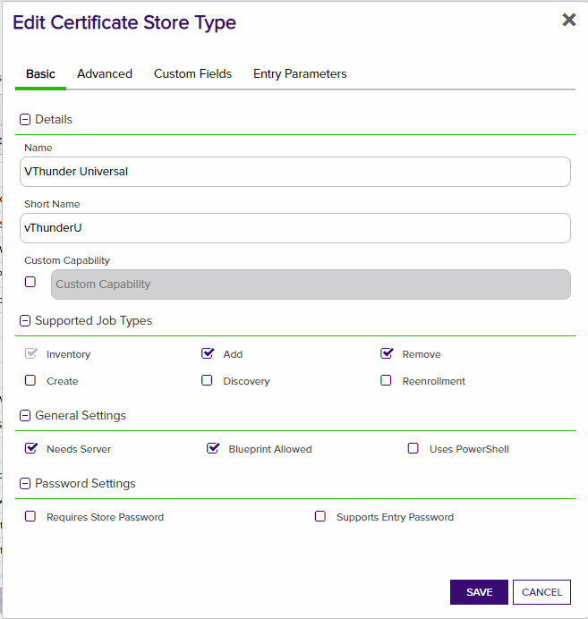
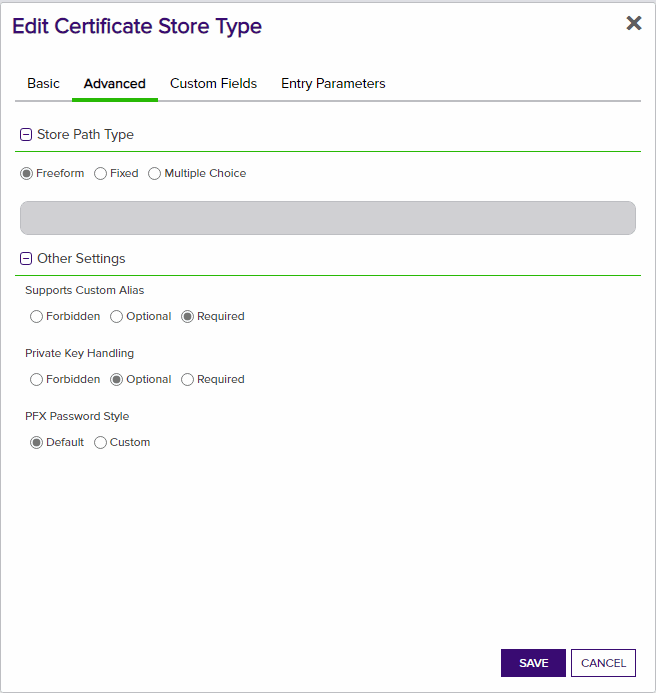
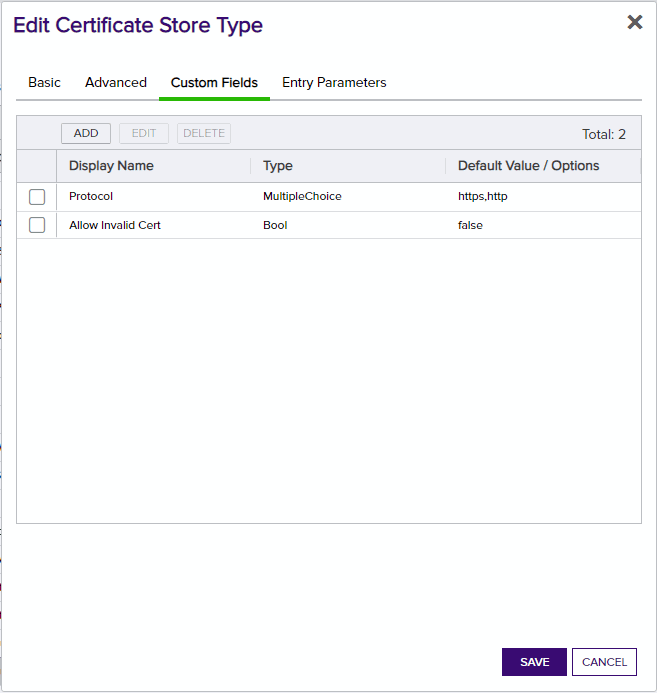
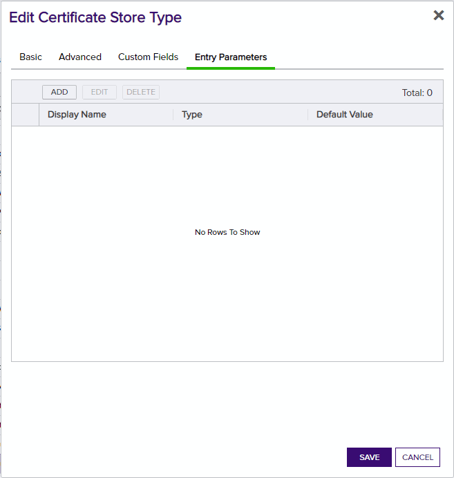
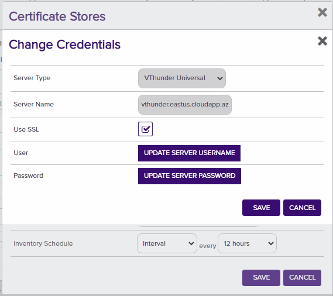

**A10 Networks vThunder Orchestrator**

**Overview**

A10 vThunder AnyAgent allows an organization to inventory and deploy certificates in any domain that the appliance services. The AnyAgent deploys the appropriate files (.cer, .pem) within the defined directories and also performs and Inventory on the Items.

This agent implements three job types – Inventory, Management Add, and Management Remove. Below are the steps necessary to configure this AnyAgent.  It supports adding certificates with or without private keys.

**A10 vThunder Configuration**

1. Read up on [A10 Networks ADC](https://a10networks.optrics.com/downloads/datasheets/Thunder-Application-Delivery-Controller-ADC.pdf) and how it works.
2. A user account is needed with the appropriate permissions on vThunder to manage certificates.

**1. Create the New Certificate Store Type for the A10 vThunder Orchestrator**

In Keyfactor Command create a new Certificate Store Type similar to the one below:

#### STORE TYPE CONFIGURATION
SETTING TAB  |  CONFIG ELEMENT	| DESCRIPTION
------|-----------|------------------
Basic |Name	|Descriptive name for the Store Type.  A10 vThunder can be used.
Basic |Short Name	|The short name that identifies the registered functionality of the orchestrator. Must be vThunderU
Basic |Custom Capability|Unchecked
Basic |Job Types	|Inventory, Add, and Remove are the supported job types. 
Basic |Needs Server	|Must be checked
Basic |Blueprint Allowed	|checked
Basic |Requires Store Password	|Determines if a store password is required when configuring an individual store.  This must be unchecked.
Basic |Supports Entry Password	|Determined if an individual entry within a store can have a password.  This must be unchecked.
Advanced |Store Path Type| Determines how the user will enter the store path when setting up the cert store.  Freeform
Advanced |Supports Custom Alias	|Determines if an individual entry within a store can have a custom Alias.  This must be Required
Advanced |Private Key Handling |Determines how the orchestrator deals with private keys.  Optional
Advanced |PFX Password Style |Determines password style for the PFX Password. Default
Custom Fields|protocol|Name:protocol Display Name:Protocol Type:Multiple Choice (http,https) Default Value:https Required:True
Custom Fields|allowInvalidCert|Name:allowInvalidCert Display Name:Allow Invalid Cert Type:Bool Default Value:false Required:True
Entry Parameters|N/A| There are no Entry Parameters

**Basic Settings:**

**Advanced Settings:**

**Custom Fields:**

**Entry Params:**

**2. Register the A10 vThunder Orchestrator with Keyfactor**
1. Stop the Keyfactor Universal Orchestrator Service for the orchestrator you plan to install this extension to run on.
2. In the Keyfactor Orchestrator installation folder (by convention usually C:\Program Files\Keyfactor\Keyfactor Orchestrator), find the "extensions" folder. Underneath that, create a new folder named "vThunderU". You may choose to use a different name, but then you must edit the manifest.json file downloaded from GitHub (Step 3) and modify based on Step 5 below.
3. Download the latest version of the A10 orchestrator extension from [GitHub](https://github.com/Keyfactor/a10vthunder-orchestrator).
4. Copy the contents of the download installation zip file to the folder created in Step 2.
5. (Optional) If you decided to name the folder created in Step 2 to something different than the suggested name (vThunderU), you will need to edit the manifest.json file. Modify "CertStores.{folder name}.Capability" to the folder name you created in Step 2.
6. Start the Keyfactor Universal Orchestrator Service.

Please reference the "Keyfactor Orchestrators Installation and Configuration Guide" obtainable from your Keyfactor contact/representative for more information regarding this step.

**3. Create a A10 vThunder Certificate Store within Keyfactor Command**
In Keyfactor Command create a new Certificate Store similar to the one below

#### STORE CONFIGURATION 
CONFIG ELEMENT	|DESCRIPTION
----------------|---------------
Category	|The type of certificate store to be configured. Select category based on the display name configured above "VThunder Universal".
Container	|This is a logical grouping of like stores. This configuration is optional and does not impact the functionality of the store.
Client Machine	|The url to the vThunder api.  This file should the url and port of the vThunder api sample vThunder.test.com:1113.
Store Path	|This will be "cert".  This is not used but just hard code it as "cert".
Allow Invalid Cert|Only used for testing should be false in production.
Protocol| http is only used for testing should be https in production
Orchestrator	|This is the orchestrator server registered with the appropriate capabilities to manage this certificate store type. 
Inventory Schedule	|The interval that the system will use to report on what certificates are currently in the store. 
Use SSL	|This should be checked.
User	|This is the user name for the vThunder api to access the certficate management functionality.
Password |This is the password for the vThunder api to access the certficate management functionality.

*** 

### TEST CASES

Case Number|Case Name|Case Description|Store Path|Overwrite Flag|Alias Name|Expected Results|Passed
-----------|---------|----------------|----------|--------------|----------|----------------|--------------
1|Fresh Add SSL Certificate With Private Key|Will create new SSL certificate and private key on the vThunder appliance in shared partition|shared|true|WebServerSSL|The new WebServerSSL certificate and private key will be created in SSL certificate store on vThunder|True
1a|Replace SSL Cert with no overwrite flag|Should warn user that a cert cannot be replaced with the same name without overwrite flag|shared|false|WebServerSSL|Error message indicating overwrite flag must be used|True
1b|Replace SSL Cert with overwrite flag (unbound)|Will replace certificate and private key on vThunder for unbound certificate|shared|true|WebServerSSL|Certificate will be removed and re-added because it's not bound to templates|True
2|Add SSL Cert Without Private Key|This will create a certificate with no private key on vThunder|shared|false|PublicCertOnly|Only certificate will be added to vThunder SSL store with no private key|True
2a|Replace SSL Cert Without Private Key|This will replace a certificate with no private key on vThunder|shared|true|PublicCertOnly|Only certificate will be replaced on vThunder with no private key|True
2b|Replace SSL Cert Without Private Key no overwrite flag|Should warn user that a cert cannot be replaced with the same name without overwrite flag|shared|false|PublicCertOnly|Error message indicating overwrite flag must be used|True
3|Remove Unbound SSL Certificate and Private Key|Certificate and Private Key will be removed from A10|shared|N/A|WebServerSSL|Certificate and key will be removed from vThunder SSL store|True
3a|Remove SSL Certificate without Private Key|Certificate will be removed from A10|shared|N/A|PublicCertOnly|Certificate will be removed from vThunder SSL store|True

### Template-Bound Certificate Operations

Case Number|Case Name|Case Description|Store Path|Overwrite Flag|Alias Name|Expected Results|Passed
-----------|---------|----------------|----------|--------------|----------|----------------|--------------
4|Replace Server-SSL Template-Bound Certificate|Will create new timestamped certificate and update server-ssl templates|shared|true|APIGatewayCert|New certificate created with timestamp alias (APIGatewayCert_1672531200), server-ssl templates updated, virtual services rebound, old cert removed|True
4a|Replace Client-SSL Template-Bound Certificate|Will create new timestamped certificate and update client-ssl templates|shared|true|ClientAuthCert|New certificate created with timestamp alias (ClientAuthCert_1672531200), client-ssl templates updated, virtual services rebound, old cert removed|True
4b|Replace Multi-Template-Bound Certificate|Will create new timestamped certificate and update both server-ssl and client-ssl templates|shared|true|DualPurposeCert|New certificate created with timestamp, both template types updated with consistent alias, all virtual services rebound|True
4c|Attempt to Remove Template-Bound Certificate|Should fail with informative error about certificate being in use|shared|N/A|BoundServerCert|Error indicating certificate is bound to SSL templates and cannot be removed|True

### Partition Operations

Case Number|Case Name|Case Description|Store Path|Overwrite Flag|Alias Name|Expected Results|Passed
-----------|---------|----------------|----------|--------------|----------|----------------|--------------
5|Add SSL Certificate to Custom Partition|Certificate will be added to specified partition instead of shared|tenant-prod|false|TenantWebCert|Certificate added to "tenant-prod" partition, isolated from shared partition|True
5a|Remove SSL Certificate from Custom Partition|Certificate will be removed from specified partition|tenant-prod|N/A|TenantWebCert|Certificate removed from "tenant-prod" partition, shared partition unaffected|True
5b|Replace Certificate in Custom Partition with Template Binding|Certificate replacement with template updates in specific partition|tenant-prod|true|TenantAPICert|New timestamped certificate created in partition, partition-specific templates updated|True

### Inventory Operations

Case Number|Case Name|Case Description|Store Path|Overwrite Flag|Alias Name|Expected Results|Passed
-----------|---------|----------------|----------|--------------|----------|----------------|--------------
6|Inventory SSL Certificates from Shared Partition|Inventory of SSL certificates will be pulled from shared partition|shared|N/A|N/A|All SSL certificates in shared partition inventoried with private key flags and metadata|True
6a|Inventory SSL Certificates from Custom Partition|Inventory of SSL certificates will be pulled from specified partition|tenant-prod|N/A|N/A|All SSL certificates in "tenant-prod" partition inventoried, isolated from other partitions|True
6b|Inventory Mixed Certificate Types|Inventory should handle certificates with and without private keys|shared|N/A|N/A|Certificates with private keys marked as PrivateKeyEntry=true, certificates without marked as false|True

### API Version Compatibility

Case Number|Case Name|Case Description|Store Path|Overwrite Flag|Alias Name|Expected Results|Passed
-----------|---------|----------------|----------|--------------|----------|----------------|--------------
7|API v4 Detection and Template Operations|System should detect A10 software version 4.x and use appropriate API format for template updates|shared|true|V4TestCert|API v4 format detected and used for template updates, version info logged showing 4.x software|True
7a|API v6 Detection and Template Operations|System should detect A10 software version 6.x and use appropriate API format for template updates|shared|true|V6TestCert|API v6 format detected and used for template updates (default), version info logged|True

## ThunderMgmt Store Type Test Cases

### SCP Certificate Operations

Case Number|Case Name|Case Description|Store Path|Overwrite Flag|Alias Name|Expected Results|Passed
-----------|---------|----------------|----------|--------------|----------|----------------|--------------
8|Fresh Add Management Certificate via SCP|Will upload certificate files to SCP server and install on A10 management interface|/home/certuser|true|MgmtInterface2025|Files MgmtInterface2025.crt and MgmtInterface2025.key created on SCP server, A10 loads certificate via API|True
8a|Replace Management Certificate with overwrite flag|Will replace existing certificate files and reload on A10 management interface|/home/certuser|true|MgmtInterface2025|Existing files overwritten, A10 reloads certificate, 60-second delay observed, memory written|True
8b|Replace Management Certificate without overwrite flag|Should warn user that files cannot be replaced without overwrite flag|/home/certuser|false|MgmtInterface2025|Error indicating files exist and overwrite flag must be used|True
9|Add Management Cert Without Private Key|This will create certificate file only on SCP server|/home/certuser|false|MgmtCertOnly|Only .crt file will be created on SCP server, no .key file, A10 API called for certificate only|True
10|Remove Management Certificate Files|Certificate files will be removed from SCP server|/home/certuser|N/A|MgmtInterface2025|Both .crt and .key files deleted from SCP server, A10 management configuration unchanged|True

### SCP Server Connectivity and Error Handling

Case Number|Case Name|Case Description|Store Path|Overwrite Flag|Alias Name|Expected Results|Passed
-----------|---------|----------------|----------|--------------|----------|----------------|--------------
11|Inventory Management Certificates from SCP|Inventory of certificate files will be retrieved from SCP server directory|/home/certuser|N/A|N/A|All valid PEM certificates in SCP directory inventoried, invalid files skipped gracefully|True
11a|SCP Authentication Failure|Should handle SCP authentication errors gracefully|/home/certuser|N/A|TestCert|Clear authentication error message, operation fails safely, security not compromised|True
11b|SCP Network Connectivity Issues|Should handle network connectivity issues to SCP server|/home/unreachable|N/A|TestCert|Network timeout error captured, distinguishes from authentication errors, provides troubleshooting guidance|True
11c|Remote File Already Exists Check|Should properly detect existing files on SCP server before upload|/home/certuser|false|ExistingCert|File existence check works correctly, appropriate error when overwrite=false and file exists|True

## Cross-Store Integration Test Cases

Case Number|Case Name|Case Description|Store Types|Expected Results|Passed
-----------|---------|----------------|-----------|----------------|--------------
12|Concurrent SSL and Management Operations|Both store types should operate independently without interference|ThunderSsl + ThunderMgmt|SSL operations use AXAPI endpoints, Management operations use SCP+API, no conflicts or interference|True
12a|PAM Integration Across Store Types|PAM credential resolution should work for both store types|ThunderSsl + ThunderMgmt|All PAM-eligible fields resolved securely across both store types, different credential contexts maintained|True
12b|Mixed Partition and SCP Operations|Operations in SSL partitions should not affect SCP-based management operations|ThunderSsl (custom partition) + ThunderMgmt|SSL partition operations isolated from SCP operations, both succeed independently|True

## Error Recovery and Edge Case Test Cases

Case Number|Case Name|Case Description|Store Path|Overwrite Flag|Alias Name|Expected Results|Passed
-----------|---------|----------------|----------|--------------|----------|----------------|--------------
13|Template Update Failure Recovery|Should handle failures during template update phase and rollback virtual service bindings|shared|true|RecoveryTest|Original template bindings restored to virtual services, new certificate cleaned up if possible, detailed error logging|True
13a|Virtual Service Rebind Partial Failure|Should handle partial failures when rebinding templates to virtual services|shared|true|RebindTest|Failed bindings logged clearly, successful bindings remain, system state documented for manual recovery|True
13b|Long Alias Name Handling|Should handle alias names approaching character limits and truncate appropriately for timestamps|shared|true|VeryLongAliasNameThatExceedsNormalLimitsAndNeedsToBeHandledGracefullyByTheSystem|Alias truncated to fit timestamp within 240 character limit, operation succeeds|True
13c|A10 API Connection Loss During Operation|Should handle API connection failures during multi-step operations|shared|true|ConnectionTest|Operation fails gracefully, system state logged, rollback attempted where possible|True

